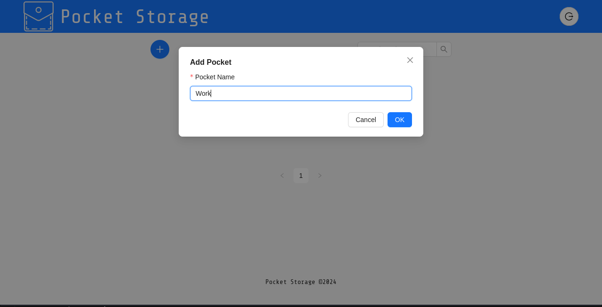

# Pocket Storage - Frontend

This is the frontend part of the **Pocket Storage** project.

## Table of Contents
- [Getting Started](#getting-started)
- [Technologies Used](#technologies-used)
- [Installation](#installation)
- [Running the Project](#running-the-project)
- [Application Guide](#application-guide)
- [License](#license)

## Getting Started
These instructions will help you set up and run the project on your local machine for development and testing purposes.

### Prerequisites
Make sure you have the following installed on your local machine:
- [Node.js](https://nodejs.org/) (v16.x or higher)
- [npm](https://www.npmjs.com/)

## Technologies Used
- **React.js** - JavaScript library for building user interfaces
- **Ant Design** - UI component library
- **Axios** - Promise-based HTTP client
- **React Router** - For routing between components

## Installation
Clone the repository to your local machine:

```bash
git clone https://github.com/Sergaros/front-end-pocket-storage.git
cd front-end-pocket-storage
npm install
```

## Running the Project
To start the development server, run:
```bash
npm run dev
```
The project will now be running locally. Open your browser and navigate to http://localhost:5173 to view the app.
**⚠️ Warning:** This is only the frontend of the application. You must run the backend for full functionality.

## Application Guide

### 1. **Login Screen**
   - **Purpose**: The entry point of the application. Users must log in to access their storage pockets.

   

### 2. **Pockets**
   - **Overview**: Pockets represent individual storage containers for files. Users can create, rename, delete, search for, and open pockets.

   By the first time you will see empty storage like on sreen:

   

   Next, create one or more pockets. A pocket like a global directory.
   
   #### Features:
   - **Create Pocket**:
     - Allows users to add a new pocket.
     - Input field for pocket name.

     

   - **Rename Pocket**:
     - Option to rename an existing pocket.
     - Editable text field for updating the pocket name.
   - **Delete Pocket**:
     - Permanently removes a pocket and all its contents.
     - Includes a confirmation dialog to prevent accidental deletion.
   - **Search Pockets**:
     - Search bar for finding pockets by name.

     

   - **Open Pocket**:
     - Opens the selected pocket to view or manage items within it.

     

### 3. **Item Management**
   - **Overview**: Items are stored inside pockets. Users can create, rename, delete items, edit permissions, and generate links for sharing.
   
   #### Features:
   - **Create Item**:
     - Allows users to add a new item (file/directory) to a pocket.
     - Input fields for item details such as name, permissions.

      

   - **Rename Item**:
     - Option to rename an existing item.
     - Editable text field for updating the item name.
   - **Copy Item**:
     - Option to move an existing item to other parent.
     - Select one of the available directory.

      

   - **Delete Item**:
     - Permanently removes an item from the pocket.
     - Includes a confirmation dialog to prevent accidental deletion.
   - **Edit Item Permissions**:
     - Allows users to control who can view or modify the item.
     - Permission settings: viewer or editor. You can share permissions only for existing users.

      

      
   - **Get Link**:
     - Generates a shareable link for the item.

## License
This project is licensed under the MIT License.